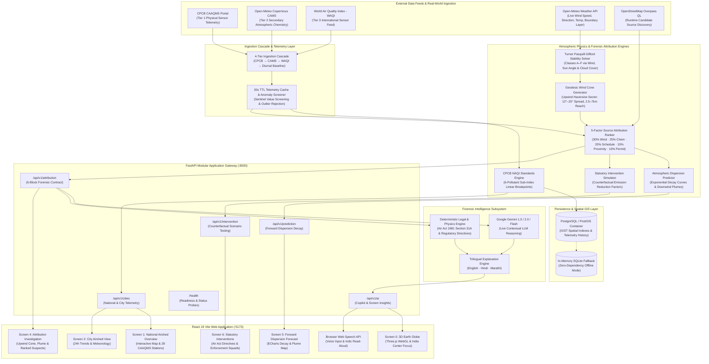

# AeroTrace A(Q)I

**Trace the air. Understand the source.**

AeroTrace A(Q)I is an environmental spatial attribution and atmospheric forensic intelligence platform for India. When ambient air quality sensors detect a pollution spike, conventional dashboards only report the severity number; AeroTrace identifies **where the pollution came from, why it spiked, who is accountable, and how it will disperse downwind**.

- **Live Prototype:** [DEPLOYED LINK]
- **Demo Video:** [VIDEO LINK]
- **Pitch Deck:** [DECK LINK]
- **Target Audience:** State Pollution Control Boards (SPCBs), Municipal Corporations (PMC, MCGM, DPCC), Environmental Enforcement Squads, and Affected Citizens.

---

## What It Does

Conventional dashboards report **what** the AQI is. AeroTrace answers **where it came from**.

1. **Detect (Surveillance & Ingestion):**
   Continuously ingests multi-pollutant telemetry ($\text{PM}_{2.5}, \text{PM}_{10}, \text{NO}_2, \text{SO}_2, \text{CO}, \text{O}_3$) from **28 physical CAAQMS stations across 7 Indian metropolitan airsheds** (Pune, Mumbai, Delhi, Bengaluru, Kolkata, Hyderabad, Chennai) using the official Central Pollution Control Board (CPCB) National AQI sub-index formulas.
2. **Attribute (Atmospheric Forensic Attribution):**
   Classifies planetary boundary layer turbulence into **Turner / Pasquill-Gifford stability classes (A through F)** using live solar elevation, wind velocity, and cloud cover. Constructs an upwind geodesic dispersion cone and ranks candidate industrial, construction, and traffic sources inside it across **five weighted physical and compliance criteria**.
3. **Forecast (Forward Dispersion & Advection):**
   Projects concentration decay over 1-to-24-hour horizons using stability-dependent decay rates, computing dynamic downwind plume footprints with widening confidence bounds.
4. **Enforce & Alert (Statutory Directives & Civic Alerts):**
   Synthesizes legally grounded inspection directives pursuant to **Section 31A of the Air (Prevention and Control of Pollution) Act, 1981**, dispatches municipal rapid-response squads with estimated ETAs, and generates trilingual health advisories in **English, Hindi (हिंदी), and Marathi (मराठी)**.

---

## System Architecture



---

## How Atmospheric Attribution Works

When a station experiences an exceedance event ($\text{AQI} > 150$ or sudden species concentration delta), AeroTrace executes a multi-step physics-guided forensic workflow:

| Stage | Scientific Method & Implementation |
| :--- | :--- |
| **1. Atmospheric Stability** | Implements the **Turner / Pasquill-Gifford method** in [`app/pasquill.py`](file:///d:/Projects/AeroTrace%20A(Q)I/app/pasquill.py). Determines the atmospheric stability class (A = Extremely Unstable through F = Moderately Stable) based on 10m surface wind speed, solar zenith angle (insolation), and fractional cloud cover. |
| **2. Upwind Cone Geometry** | Computes the upwind bearing ($\theta_{\text{upwind}} = (\text{wind\_direction} + 180^\circ) \pmod{360^\circ}$) using **Haversine geodesic forward projections** in [`app/wind_cone.py`](file:///d:/Projects/AeroTrace%20A(Q)I/app/wind_cone.py). The half-angle narrows with stability (from $25^\circ$ in Class A down to $12^\circ$ in Class F) and reach scales between $2.5\text{ km}$ and $7.0\text{ km}$. |
| **3. Spatial Candidate Intersect** | Intersects the upwind polygon with physical candidates from our **station-specific landmark registry** ([`app/station_templates.py`](file:///d:/Projects/AeroTrace%20A(Q)I/app/station_templates.py)) and runtime **OpenStreetMap Overpass QL** spatial queries ([`app/overpass_client.py`](file:///d:/Projects/AeroTrace%20A(Q)I/app/overpass_client.py)). |
| **4. Multi-Factor Scoring** | Evaluates all candidate sources inside the reach radius using a transparent 5-factor scoring model in [`app/scoring.py`](file:///d:/Projects/AeroTrace%20A(Q)I/app/scoring.py). |

### 5-Factor Weighted Attribution Algorithm

$$\text{Confidence Score} = w_{\text{wind}} S_{\text{wind}} + w_{\text{chem}} S_{\text{chem}} + w_{\text{time}} S_{\text{time}} + w_{\text{dist}} S_{\text{dist}} - P_{\text{compliance}}$$

| Factor | Weight | Scientific & Operational Rationale |
| :--- | :---: | :--- |
| **Wind Alignment ($S_{\text{wind}}$)** | **30%** | Angular deviation between the source bearing and the central upwind vector; uses cosine bell decay. |
| **Chemical Fingerprint ($S_{\text{chem}}$)** | **25%** | Matches observed species ratios ($\text{PM}_{2.5} / \text{PM}_{10}$, $\text{SO}_2 / \text{NO}_2$) against source emission profiles (combustion, industrial stacks, fugitive dust). |
| **Operating Schedule ($S_{\text{time}}$)** | **20%** | Temporal overlap between the station spike timestamp and the facility's permitted operating shifts or traffic peak windows. |
| **Proximity ($S_{\text{dist}}$)** | **15%** | Inverse-distance decay modeling Gaussian plume dilution over distance ($1 / (1 + \alpha d)$). |
| **Compliance Penalty ($P_{\text{compliance}}$)** | **10%** | State Pollution Control Board regulatory history: unpermitted operations or active 90-day violation flags increase suspect priority. |

> [!NOTE]
> **Regulatory Disclaimer:** Attribution scores are an objective, multi-criteria index designed to help environmental marshals prioritize on-site physical inspections. They represent spatial-atmospheric correlation, not judicial proof of causation.

---

## Where Google AI & Gemini Are Used

AeroTrace pairs rigorous deterministic physics engines with **Google Gemini** for reasoning, contextualization, and multilingual translation:

* **Contextual Intelligence:** Gemini generates grounded technical and policy insights across city overviews, station spikes, weather dynamics, dispersion forecasts, and statutory counterfactuals using strictly typed data contracts.
* **Indic Language Localization:** Full natural-language explanations and voice capabilities in **English, Hindi (हिंदी), and Marathi (मराठी)**.
* **Browser Voice Interaction:** Integration with the browser **Web Speech API** for hands-free speech input and audible read-aloud of forensic briefs for field officers.
* **Deterministic Legal Fallback:** If the Gemini API is unreachable, quota is exhausted, or the host is offline, [`app/ai_service.py`](file:///d:/Projects/AeroTrace%20A(Q)I/app/ai_service.py) automatically activates the built-in deterministic engine (`TemplateFallbackAIService`). It outputs legally structured advisories citing **Section 31A of the Air Act 1981** without failing or stalling the UI.
* **Backend Security:** The `GEMINI_API_KEY` remains securely isolated on the backend server and is never transmitted to client browsers.

---

## Ingestion Cascade & Fallback Tiers

AeroTrace guarantees 100% operational uptime through a 4-tier ingestion failover cascade:

| Tier | Provider / Protocol | Purpose | Fallback Condition |
| :---: | :--- | :--- | :--- |
| **1** | **CPCB CAAQMS Real-Time Portal** | Primary physical sensor telemetry from monitoring stations across India. | Rate-limit, connection timeout, or portal downtime. |
| **2** | **Open-Meteo Air Quality (Copernicus CAMS)** | Satellite-calibrated atmospheric reanalysis data for primary criteria pollutants. | Unreachable network or missing pollutant species. |
| **3** | **WAQI (World Air Quality Index)** | Global sensor aggregation network feed. | Missing station mapping or token limits. |
| **4** | **Physical Diurnal Baseline Simulation** | Deterministic diurnal pollutant curves calibrated to the historical baseline of that specific station. | Complete external network outage (explicitly tagged `is_simulated: true`). |

**Meteorology Feed:** Live 10m wind speed, wind bearing, air temperature, relative humidity, atmospheric pressure, and planetary boundary layer mixing height are fetched directly from **Open-Meteo** (free, no API key required).

---

## Supported Metros & Physical CAAQMS Stations

AeroTrace configures **28 verified physical CAAQMS stations across 7 major metropolitan airsheds** (4 stations per city):

| City | State | Verified Physical CAAQMS Stations |
| :--- | :--- | :--- |
| **Pune** | Maharashtra | Shivajinagar, Swargate, Hadapsar, Kothrud |
| **Mumbai** | Maharashtra | Bandra, Colaba, Worli, Andheri |
| **Delhi** | NCT of Delhi | ITO, Anand Vihar, Punjabi Bagh, RK Puram |
| **Bengaluru** | Karnataka | BTM Layout, City Railway Station, Peenya, Saneguruvanahalli |
| **Kolkata** | West Bengal | Victoria Memorial, Rabindra Bharati University, Ballygunge, Jadavpur |
| **Hyderabad** | Telangana | Sanathnagar, Zoo Park, ICRISAT, Central University |
| **Chennai** | Tamil Nadu | Alandur Bus Depot, Manali, Velachery, IIT Madras |

> [!TIP]
> Every single station has dedicated, hyper-local physical landmark sources in [`app/station_templates.py`](file:///d:/Projects/AeroTrace%20A(Q)I/app/station_templates.py) (e.g. Sassoon Docks in Colaba vs BKC in Bandra vs Marol MIDC in Andheri), ensuring authentic geographic forensic attribution.

---

## Quick Start & Running Locally

### Option A: One-Click Full-Stack Docker (Recommended)

Requires **Docker Desktop** only. No local Python or Node.js installation is required:

```bash
# 1. Clone the repository
git clone https://github.com/priyamanna13/AeroTrace-A-Q-I.git
cd AeroTrace-A-Q-I

# 2. Configure environment
cp .env.example .env
# Optional: Add your GEMINI_API_KEY in .env for live AI insights

# 3. Spin up the entire full-stack platform (PostGIS + FastAPI + Vite React)
docker compose up --build
```

*(On Windows, you can also simply double-click [`docker_start_all.bat`](file:///d:/Projects/AeroTrace%20A(Q)I/docker_start_all.bat)).*

Open your browser to:
* **Frontend Web App:** `http://localhost:5173`
* **FastAPI Interactive Docs:** `http://localhost:8000/docs`
* **Health Check Probe:** `http://localhost:8000/health`

---

### Option B: Local Development (Host Python + Node.js)

For active code development and hot-reloading:

```bash
# 1. Start the PostgreSQL / PostGIS container
docker compose up -d db

# 2. Configure environment
cp .env.example .env

# 3. Setup and start Backend (Python 3.12)
pip install -r requirements.txt
python -m uvicorn app.api:app --host 127.0.0.1 --port 8000 --reload

# 4. In a separate terminal, setup and start Frontend (Node 18+)
cd frontend
npm install
npm run dev
```

*(On Windows, you can also double-click [`start_all.bat`](file:///d:/Projects/AeroTrace%20A(Q)I/start_all.bat) to launch the database, backend, and frontend automatically).*

---

### Option C: Zero-Database Dry-Run Mode

You can run the full attribution pipeline and verify the immutable data contract without running PostgreSQL/PostGIS:

```bash
DATABASE_URL="sqlite:///:memory:" python scripts/run_demo.py --dry-run
```

---

## Testing & Quality Assurance

AeroTrace maintains a comprehensive automated testing and audit suite:

```bash
# Run all 290 unit, integration, and live attribution tests
pytest -v

# Run the 20-point production readiness and demonstration audit
python scripts/verify_production_readiness.py
```

### Production Readiness Verification Report
```text
==============================================================================
  AeroTrace NGEC 2026 — Production QA & Demo Readiness Audit
==============================================================================
Category        | Verification Check                       | Result            
------------------------------------------------------------------------------
Health          | GET /health 200 OK                       | [PASS] status=ok
                | Total Physical Stations == 28            | [PASS] count=28
                | Scaled Cache Metrics Visible             | [PASS] max_size=512
Stations        | Configured Cities == 7                   | [PASS] cities=7
                | Physical Station Count == 28 (4 per city)| [PASS] total=28
                | Coordinates in Valid Geographic Bounds   | [PASS] All 28 verified CAAQMS GPS
Meteorology     | All 7 Cities Live Weather Feeds          | [PASS] Open-Meteo & Pasquill A-F operational
Attribution     | 7-City Key Stations Attribution 200 OK   | [PASS] 6-block contract complete
                | Wind Cone Polygon Geometry Valid         | [PASS] Valid GeoJSON Polygon
                | Candidate Source Attribution Non-Empty   | [PASS] Curated + OSM candidates ranked
Prediction      | Screen 5 6-Hour Forward Forecast         | [PASS] frames=6
                | Mandatory Methodology Transparency Label | [PASS] Estimated forecast - see methodology
                | Downwind Advection Plume GeoJSON         | [PASS] Dynamic Polygon Footprint
Intervention    | Screen 6 Statutory Intervention Simulate | [PASS] delta=5
                | Mandatory Policy Planning Disclaimer     | [PASS] Statutory advisory present
                | Sensitive Receptors Non-Fabrication Rule | [PASS] Zero fictitious schools/hospitals
Simulation      | Manual Spike Trigger (Demo Risk Mit.)    | [PASS] is_spike=true
                | Explicit 'simulation: true' Tag          | [PASS] simulation_params present
Security        | Security Headers Attached (nosniff, DENY)| [PASS] X-Content-Type & X-Frame-Options
                | Database Password Masking Verified       | [PASS] sanitized_database_url operational
------------------------------------------------------------------------------
Summary: 20/20 checks passed (100.0%) in 15.24s
>>> VERDICT: PRODUCTION READY FOR PJMT NGEC 2026 EVALUATION <<<
==============================================================================
```

---

## Adding a New City

Adding a new metropolitan airshed requires zero code changes to the mathematical and attribution engines:

1. Create `city_configs/<city_name>.yml`.
2. Define the city bounding box (`south, west, north, east`) and its 4 physical CAAQMS stations with coordinates and elevations.
3. Add hyper-local candidate sources to [`app/station_templates.py`](file:///d:/Projects/AeroTrace%20A(Q)I/app/station_templates.py) or let OpenStreetMap Overpass discover them dynamically at runtime.

---

## Known Limitations & Roadmap

### Known Limitations
* **Single-Station Meteorology:** The upwind cone projection currently uses the wind vector from the monitoring station's immediate coordinates; complex micro-urban canyon flows are modeled via Pasquill dispersion broadening rather than full Computational Fluid Dynamics (CFD).
* **Public CPCB Access:** Because the national CPCB CCR dashboard does not offer authenticated public REST streams for all stations, our 4-tier cascade utilizes OpenData tokens and satellite reanalysis fallback tiers.

### Future Roadmap
* **Crowdsourced Citizen Intake:** WhatsApp and web portal reporting with Gemini Vision photo verification for smouldering garbage piles and unshielded construction dust.
* **High-Resolution Municipal GIS Integration:** Direct integration with state municipal GIS layers for automated boundary checking of schools and hospitals.
* **Vertex AI Forecaster:** Training spatio-temporal Graph Neural Networks (GNNs) on historical CAAQMS telemetry for predictive early warnings.

---

## Team & Attributions

* **Development Team:** AeroTrace Engineering Team (Clean Air & Climate Resilience Track)
* **Map Data:** © [OpenStreetMap](https://www.openstreetmap.org/copyright) contributors, queried via Overpass API.
* **Sensor Telemetry:** Central Pollution Control Board (CPCB), Ministry of Environment, Forest and Climate Change (MoEFCC), Government of India; Open-Meteo Copernicus CAMS; WAQI.
* **License:** MIT License. See `LICENSE` for details.
